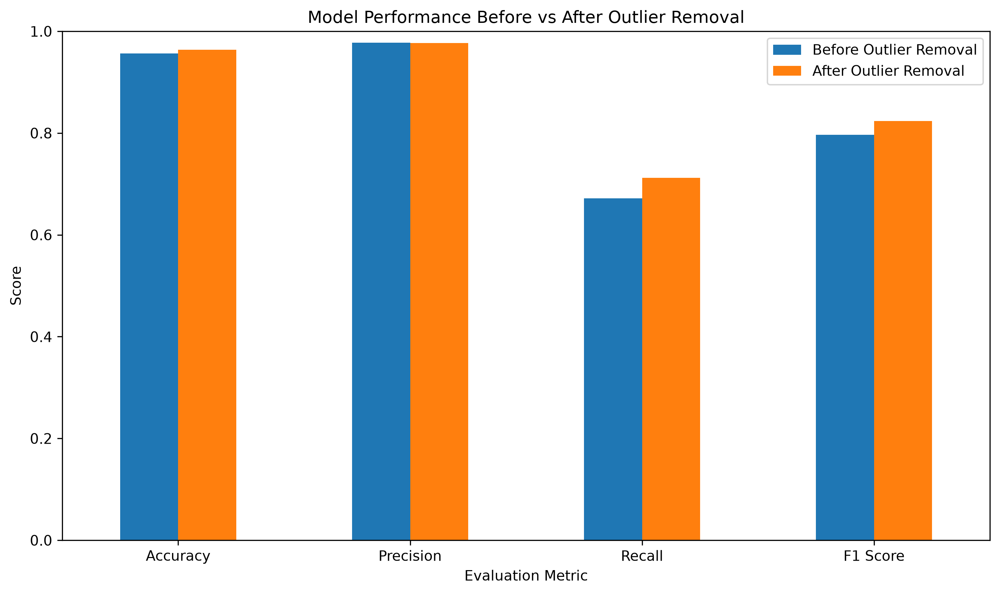

# Spam Classification and Outlier Analysis

## Overview

This project performs spam classification on an SMS dataset and investigates the effect of outlier removal on machine learning performance.

The project compares a classification model before and after removing message-length outliers.

## Objectives

- Load and explore a spam classification dataset
- Perform data preprocessing
- Analyze missing values
- Remove missing values where required
- Perform exploratory data analysis and visualization
- Detect outliers using the IQR method
- Remove message-length outliers
- Train a classification model before outlier removal
- Train the same classification model after outlier removal
- Compare model performance

## Dataset

The dataset contains SMS messages labeled as:

- `ham` — legitimate message
- `spam` — unwanted/spam message

Original dataset size:

- Total messages: 5,169
- Ham: 4,516
- Spam: 653

## Methodology

### 1. Data Preprocessing

The dataset was loaded and examined for:

- Missing values
- Duplicate records
- Data types
- Class distribution

Text messages were cleaned and numerical features were generated for exploratory analysis.

### 2. Feature Engineering

The following message-level features were analyzed:

- Message length
- Word count
- Digit count
- Uppercase count
- Special character count

TF-IDF was used to convert the SMS text into numerical features for classification.

### 3. Outlier Detection

The Interquartile Range (IQR) method was used to detect message-length outliers separately for ham and spam messages.

A value was considered an outlier when it fell below:

Q1 - 1.5 × IQR

or above:

Q3 + 1.5 × IQR

A total of 204 outliers were identified.

### 4. Outlier Removal

After removing the detected message-length outliers:

- Original messages: 5,169
- Outliers removed: 204
- Remaining messages: 4,965

Class distribution after removal:

- Ham: 4,377
- Spam: 588

## Machine Learning Model

A Logistic Regression classifier was used with TF-IDF text features.

The same classification approach was used before and after outlier removal to provide a fair comparison.

## Results

| Metric | Before Outlier Removal | After Outlier Removal |
|---|---:|---:|
| Accuracy | 95.65% | 96.37% |
| Precision | 97.78% | 97.67% |
| Recall | 67.18% | 71.19% |
| F1 Score | 79.64% | 82.35% |

## Findings

After outlier removal:

- Accuracy increased from 95.65% to 96.37%.
- Spam recall increased from 67.18% to 71.19%.
- F1-score increased from 79.64% to 82.35%.
- Precision remained almost unchanged.

Overall, removing message-length outliers improved the classification performance, particularly for spam recall and F1-score.

## Visualizations

The project includes visualizations for:

- Class distribution
- Message length distribution
- Message-length boxplots before and after outlier removal
- Confusion matrices
- Model performance comparison
- Outliers removed by class

### Model Comparison


### Outlier Removal Comparison




## Machine Learning Models

After preprocessing and outlier removal, three classification algorithms were applied:

1. Support Vector Machine (SVM)
2. Naive Bayes
3. Decision Tree

### Model Performance

| Model | Accuracy | Precision | Recall | F1 Score |
|---|---:|---:|---:|---:|
| SVM | 98.49% | 98.13% | 88.98% | 93.33% |
| Naive Bayes | 97.38% | 100.00% | 77.97% | 87.62% |
| Decision Tree | 96.88% | 93.07% | 79.66% | 85.84% |

### Best Performing Model

SVM achieved the best overall performance among the three models, with:

- Accuracy: 98.49%
- Precision: 98.13%
- Recall: 88.98%
- F1 Score: 93.33%

The results show that SVM provided the strongest overall balance between precision and recall for spam classification.

## Project Structure

```text
Spam-Classification-Outlier-Analysis/
│
├── dataset/
│   └── spam.csv
│
├── notebook/
│   └── spam_classification_analysis.ipynb
│
├── visualizations/
│   ├── class_distribution.png
│   ├── message_length_distribution.png
│   ├── boxplot_before.png
│   ├── boxplot_after.png
│   ├── confusion_matrix_before.png
│   ├── confusion_matrix_after.png
│   ├── model_comparison.png
│   └── outliers_by_class.png
│   └── outlier_removal_comparison.png
│
├── README.md
├── requirements.txt
└── .gitignore
